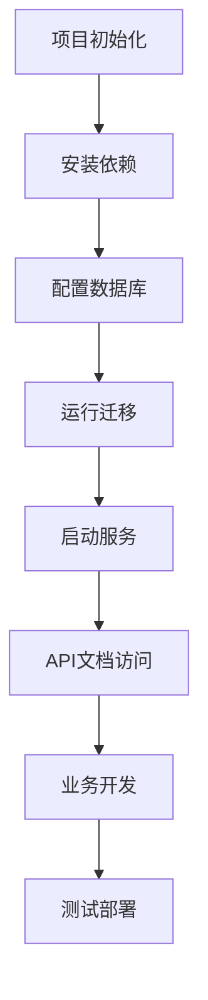

# Node.js + NestJS + TypeScript + MySQL 项目框架 - 产品需求文档

## 1. 产品概述

本项目是一个基于 Node.js + NestJS + TypeScript + MySQL 技术栈的后端API框架，旨在为开发者提供一个完整、可扩展的企业级后端服务基础架构。

- 该框架解决了快速搭建现代化后端服务的需求，为中小型企业和开发团队提供标准化的开发基础。
- 目标是成为一个可复用的企业级后端服务模板，支持快速业务开发和部署。

## 2. 核心功能

### 2.1 用户角色

| 角色 | 注册方式 | 核心权限 |
|------|----------|----------|
| 开发者 | 直接使用框架 | 可以基于框架进行业务开发，配置数据库连接，创建API接口 |
| 系统管理员 | 部署配置 | 可以配置环境变量，管理数据库，监控系统运行状态 |

### 2.2 功能模块

我们的后端框架需求包含以下主要模块：

1. **项目初始化模块**：项目结构搭建、依赖管理、基础配置文件
2. **数据库连接模块**：MySQL连接配置、数据库迁移、连接池管理
3. **API开发模块**：RESTful API结构、路由配置、控制器模板
4. **数据操作模块**：CRUD操作示例、数据验证、实体定义
5. **配置管理模块**：环境变量管理、配置文件结构、多环境支持
6. **错误处理模块**：全局异常处理、错误日志记录、统一错误响应
7. **API文档模块**：Swagger集成、接口文档自动生成、在线调试
8. **安全配置模块**：请求验证、数据校验、基础安全中间件

### 2.3 模块详情

| 模块名称 | 子模块 | 功能描述 |
|----------|--------|----------|
| 项目初始化模块 | 项目结构 | 创建标准的NestJS项目目录结构，包含src、test、config等目录 |
| 项目初始化模块 | 依赖管理 | 配置package.json，安装必要的依赖包如@nestjs/core、typeorm、mysql2等 |
| 项目初始化模块 | 基础配置 | 设置tsconfig.json、nest-cli.json等基础配置文件 |
| 数据库连接模块 | MySQL配置 | 配置TypeORM连接MySQL数据库，支持连接池和事务管理 |
| 数据库连接模块 | 实体定义 | 创建示例实体类，展示如何定义数据库表结构 |
| 数据库连接模块 | 迁移管理 | 配置数据库迁移脚本，支持版本控制和自动迁移 |
| API开发模块 | 控制器模板 | 创建示例控制器，展示RESTful API的标准实现方式 |
| API开发模块 | 服务层 | 实现业务逻辑层，展示依赖注入和服务组织方式 |
| API开发模块 | 路由配置 | 配置API路由，支持版本控制和模块化路由管理 |
| 数据操作模块 | CRUD示例 | 实现完整的增删改查操作示例，包含分页和筛选功能 |
| 数据操作模块 | 数据验证 | 集成class-validator进行请求数据验证和转换 |
| 配置管理模块 | 环境配置 | 使用@nestjs/config管理环境变量，支持.env文件和多环境配置 |
| 配置管理模块 | 配置验证 | 对配置项进行类型检查和有效性验证 |
| 错误处理模块 | 全局异常 | 实现全局异常过滤器，统一处理各种类型的错误 |
| 错误处理模块 | 日志记录 | 集成Winston日志库，支持不同级别的日志输出和文件存储 |
| API文档模块 | Swagger集成 | 配置@nestjs/swagger，自动生成API文档和在线调试界面 |
| API文档模块 | 文档注解 | 使用装饰器为API添加详细的文档说明和示例 |
| 安全配置模块 | 请求验证 | 实现请求参数验证、数据类型转换和安全检查 |
| 安全配置模块 | 中间件配置 | 配置CORS、请求限制、安全头等基础安全中间件 |

## 3. 核心流程

### 开发者使用流程
1. 克隆或下载项目框架
2. 安装项目依赖 (npm install)
3. 配置数据库连接信息 (.env文件)
4. 运行数据库迁移 (npm run migration:run)
5. 启动开发服务器 (npm run start:dev)
6. 访问Swagger文档进行API测试
7. 基于示例代码开发具体业务功能

### 系统管理员部署流程
1. 准备MySQL数据库环境
2. 配置生产环境变量
3. 构建项目 (npm run build)
4. 运行数据库迁移
5. 启动生产服务 (npm run start:prod)
6. 监控系统运行状态和日志

## 4. 用户界面设计

### 4.1 设计风格

- **主要颜色**：深蓝色 (#1890ff) 作为主色调，白色 (#ffffff) 作为背景色
- **按钮样式**：圆角按钮，具有悬停效果和点击反馈
- **字体**：使用系统默认字体，代码部分使用等宽字体 (Consolas, Monaco)
- **布局风格**：简洁的文档风格布局，左侧导航，右侧内容区域
- **图标样式**：使用简洁的线性图标，支持暗色和亮色主题

### 4.2 页面设计概览

| 页面名称 | 模块名称 | UI元素 |
|----------|----------|--------|
| Swagger API文档 | 接口列表 | 清晰的接口分组，支持折叠展开，绿色成功状态，红色错误状态 |
| Swagger API文档 | 接口详情 | 详细的参数说明，示例代码，在线测试功能，响应状态展示 |
| 开发文档 | 快速开始 | 步骤化的安装指南，代码高亮显示，复制按钮 |
| 开发文档 | API参考 | 结构化的API文档，搜索功能，代码示例 |

### 4.3 响应式设计

本项目主要面向开发者，以桌面端为主，同时考虑移动端的基本适配。Swagger文档界面支持响应式布局，在移动设备上可以正常浏览和测试API接口。