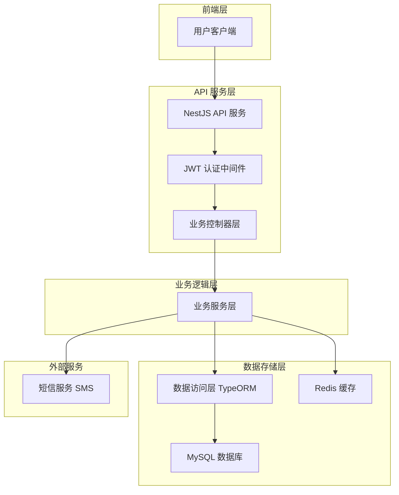
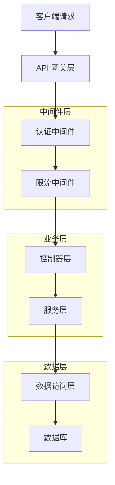
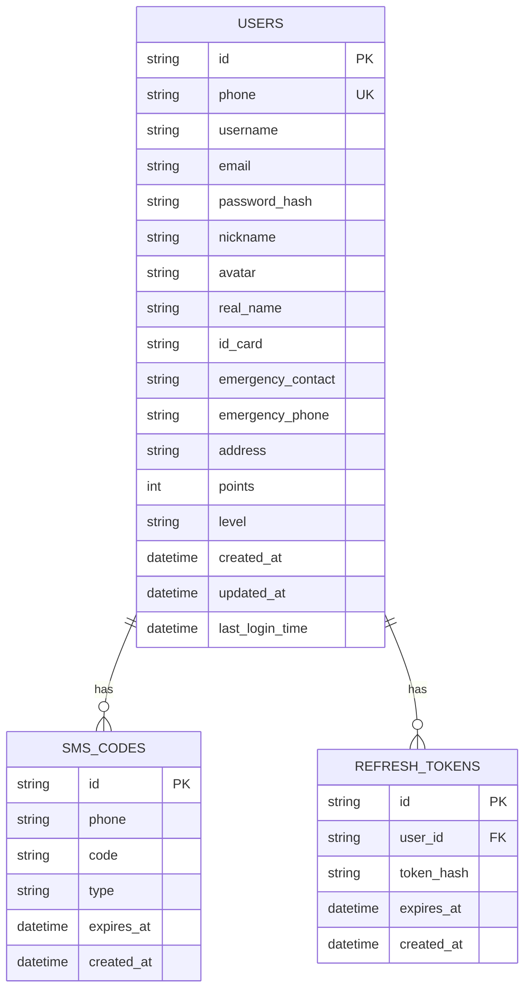
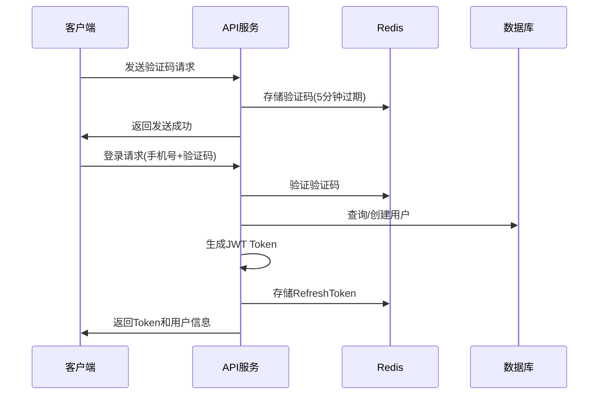

# Rescue 汽车救援平台 - 技术架构文档

## 1. 架构设计



## 2. 技术描述

- **框架**: NestJS@11 + TypeScript@5
- **数据库**: MySQL@8.0 + TypeORM@0.3
- **缓存**: Redis@7 (验证码、Token黑名单)
- **认证**: JWT + Passport
- **验证**: class-validator + class-transformer
- **文档**: Swagger/OpenAPI
- **加密**: bcrypt (密码加密)
- **限流**: @nestjs/throttler
- **包管理**: pnpm

## 3. 路由定义

| 路由 | 用途 |
|------|------|
| /api/auth/sms/send | 发送短信验证码 |
| /api/auth/login/sms | 短信验证码登录 |
| /api/auth/login/password | 密码登录 |
| /api/auth/register | 用户注册 |
| /api/auth/password/reset | 重置密码 |
| /api/auth/token/refresh | 刷新Token |
| /api/auth/logout | 退出登录 |
| /api/user/profile | 获取用户信息 |
| /api/user/password/change | 修改密码 |
| /api/users | 用户管理 (CRUD) |

## 4. API 定义

### 4.1 认证相关 API

**用户注册**
```
POST /api/auth/register
```

请求参数:
| 参数名 | 参数类型 | 是否必填 | 描述 |
|--------|----------|----------|------|
| phone | string | true | 手机号码 |
| code | string | true | 短信验证码 |
| password | string | true | 登录密码 |
| username | string | true | 用户昵称 |
| inviteCode | string | false | 邀请码 |

响应示例:
```json
{
  "code": 200,
  "message": "注册成功",
  "data": {
    "accessToken": "eyJhbGciOiJIUzI1NiIsInR5cCI6IkpXVCJ9...",
    "refreshToken": "eyJhbGciOiJIUzI1NiIsInR5cCI6IkpXVCJ9...",
    "userInfo": {
      "id": "user_123456",
      "phone": "13800138000",
      "nickname": "救援用户"
    }
  }
}
```

**短信验证码登录**
```
POST /api/auth/login/sms
```

请求参数:
| 参数名 | 参数类型 | 是否必填 | 描述 |
|--------|----------|----------|------|
| phone | string | true | 手机号码 |
| code | string | true | 验证码 |

**密码登录**
```
POST /api/auth/login/password
```

请求参数:
| 参数名 | 参数类型 | 是否必填 | 描述 |
|--------|----------|----------|------|
| phone | string | true | 手机号码 |
| password | string | true | 用户密码 |

### 4.2 用户信息 API

**获取用户信息**
```
GET /api/user/profile
```

响应参数:
| 参数名 | 参数类型 | 描述 |
|--------|----------|------|
| id | string | 用户ID |
| phone | string | 手机号码 |
| nickname | string | 用户昵称 |
| avatar | string | 头像URL |
| email | string | 邮箱地址 |
| realName | string | 真实姓名 |
| points | number | 用户积分 |
| level | string | 用户等级 |

## 5. 服务器架构图



## 6. 数据模型

### 6.1 数据模型定义



### 6.2 数据定义语言

**用户表 (users)**
```sql
-- 创建用户表
CREATE TABLE users (
    id VARCHAR(36) PRIMARY KEY DEFAULT (UUID()),
    phone VARCHAR(11) UNIQUE NOT NULL COMMENT '手机号码',
    username VARCHAR(50) NOT NULL COMMENT '用户名',
    email VARCHAR(100) UNIQUE COMMENT '邮箱',
    password_hash VARCHAR(255) NOT NULL COMMENT '密码哈希',
    nickname VARCHAR(100) COMMENT '昵称',
    avatar TEXT COMMENT '头像URL',
    real_name VARCHAR(50) COMMENT '真实姓名',
    id_card VARCHAR(18) COMMENT '身份证号',
    emergency_contact VARCHAR(50) COMMENT '紧急联系人',
    emergency_phone VARCHAR(11) COMMENT '紧急联系电话',
    address TEXT COMMENT '地址',
    points INT DEFAULT 0 COMMENT '积分',
    level VARCHAR(20) DEFAULT '普通用户' COMMENT '用户等级',
    is_active BOOLEAN DEFAULT TRUE COMMENT '是否激活',
    created_at TIMESTAMP DEFAULT CURRENT_TIMESTAMP COMMENT '创建时间',
    updated_at TIMESTAMP DEFAULT CURRENT_TIMESTAMP ON UPDATE CURRENT_TIMESTAMP COMMENT '更新时间',
    last_login_time TIMESTAMP COMMENT '最后登录时间'
);

-- 创建索引
CREATE INDEX idx_users_phone ON users(phone);
CREATE INDEX idx_users_email ON users(email);
CREATE INDEX idx_users_created_at ON users(created_at);

-- 短信验证码表 (sms_codes)
CREATE TABLE sms_codes (
    id VARCHAR(36) PRIMARY KEY DEFAULT (UUID()),
    phone VARCHAR(11) NOT NULL COMMENT '手机号码',
    code VARCHAR(6) NOT NULL COMMENT '验证码',
    type ENUM('login', 'register', 'reset_password') NOT NULL COMMENT '验证码类型',
    expires_at TIMESTAMP NOT NULL COMMENT '过期时间',
    created_at TIMESTAMP DEFAULT CURRENT_TIMESTAMP COMMENT '创建时间'
);

-- 创建索引
CREATE INDEX idx_sms_codes_phone ON sms_codes(phone);
CREATE INDEX idx_sms_codes_expires_at ON sms_codes(expires_at);

-- 刷新令牌表 (refresh_tokens)
CREATE TABLE refresh_tokens (
    id VARCHAR(36) PRIMARY KEY DEFAULT (UUID()),
    user_id VARCHAR(36) NOT NULL COMMENT '用户ID',
    token_hash VARCHAR(255) NOT NULL COMMENT 'Token哈希',
    expires_at TIMESTAMP NOT NULL COMMENT '过期时间',
    created_at TIMESTAMP DEFAULT CURRENT_TIMESTAMP COMMENT '创建时间',
    FOREIGN KEY (user_id) REFERENCES users(id) ON DELETE CASCADE
);

-- 创建索引
CREATE INDEX idx_refresh_tokens_user_id ON refresh_tokens(user_id);
CREATE INDEX idx_refresh_tokens_expires_at ON refresh_tokens(expires_at);

-- 初始化数据
INSERT INTO users (phone, username, email, password_hash, nickname, real_name, points, level) VALUES
('13800138000', 'test_user', 'test@example.com', '$2b$10$example_hash', '测试用户', '张三', 1500, 'VIP会员'),
('13900139000', 'demo_user', 'demo@example.com', '$2b$10$example_hash', '演示用户', '李四', 800, '普通用户');
```

## 7. 安全架构设计

### 7.1 认证流程



### 7.2 安全策略

1. **密码安全**
   - 使用 bcrypt 加密存储
   - 密码强度验证 (6-20位，包含字母数字)

2. **Token 安全**
   - JWT AccessToken 有效期 2小时
   - RefreshToken 有效期 7天
   - Token 黑名单机制

3. **接口安全**
   - 限流保护 (1分钟内最多5次登录尝试)
   - 验证码防刷 (同一手机号1分钟内只能发送1次)
   - 敏感信息脱敏

4. **数据安全**
   - 输入参数验证
   - SQL注入防护
   - XSS攻击防护

### 7.3 错误处理

```typescript
// 统一错误码定义
export enum ErrorCode {
  PHONE_FORMAT_ERROR = 1001,    // 手机号格式错误
  SMS_CODE_ERROR = 1002,        // 验证码错误或已过期
  USER_NOT_FOUND = 1003,        // 用户不存在
  PASSWORD_ERROR = 1004,        // 密码错误
  USER_EXISTS = 1005,           // 用户已存在
  TOKEN_INVALID = 1006,         // Token无效或已过期
  REFRESH_TOKEN_INVALID = 1007, // 刷新Token无效
  OLD_PASSWORD_ERROR = 1008,    // 原密码错误
  SMS_SEND_FREQUENT = 1009,     // 验证码发送频繁
  AVATAR_UPLOAD_ERROR = 1010    // 头像上传失败
}
```

## 8. 部署架构

### 8.1 开发环境
- **本地开发**: NestJS + MySQL + Redis
- **热重载**: nest start --watch
- **API文档**: Swagger UI

### 8.2 生产环境
- **容器化**: Docker + Docker Compose
- **云部署**: Vercel Serverless
- **数据库**: PlanetScale MySQL
- **缓存**: Redis Cloud
- **监控**: 健康检查端点

### 8.3 环境变量配置

```env
# 数据库配置
DATABASE_HOST=localhost
DATABASE_PORT=3306
DATABASE_USERNAME=root
DATABASE_PASSWORD=password
DATABASE_NAME=rescue_db

# Redis配置
REDIS_HOST=localhost
REDIS_PORT=6379
REDIS_PASSWORD=

# JWT配置
JWT_SECRET=your-secret-key
JWT_EXPIRES_IN=2h
REFRESH_TOKEN_EXPIRES_IN=7d

# 短信服务配置
SMS_ACCESS_KEY=your-access-key
SMS_SECRET_KEY=your-secret-key
SMS_SIGN_NAME=救援平台
```

## 9. 性能优化

### 9.1 缓存策略
- **验证码缓存**: Redis存储，5分钟过期
- **用户信息缓存**: 登录后缓存用户基本信息
- **Token黑名单**: Redis存储已注销的Token

### 9.2 数据库优化
- **索引优化**: 手机号、邮箱、创建时间等关键字段
- **连接池**: TypeORM连接池配置
- **查询优化**: 避免N+1查询问题

### 9.3 接口优化
- **响应压缩**: gzip压缩
- **分页查询**: 用户列表分页加载
- **字段选择**: 只返回必要字段